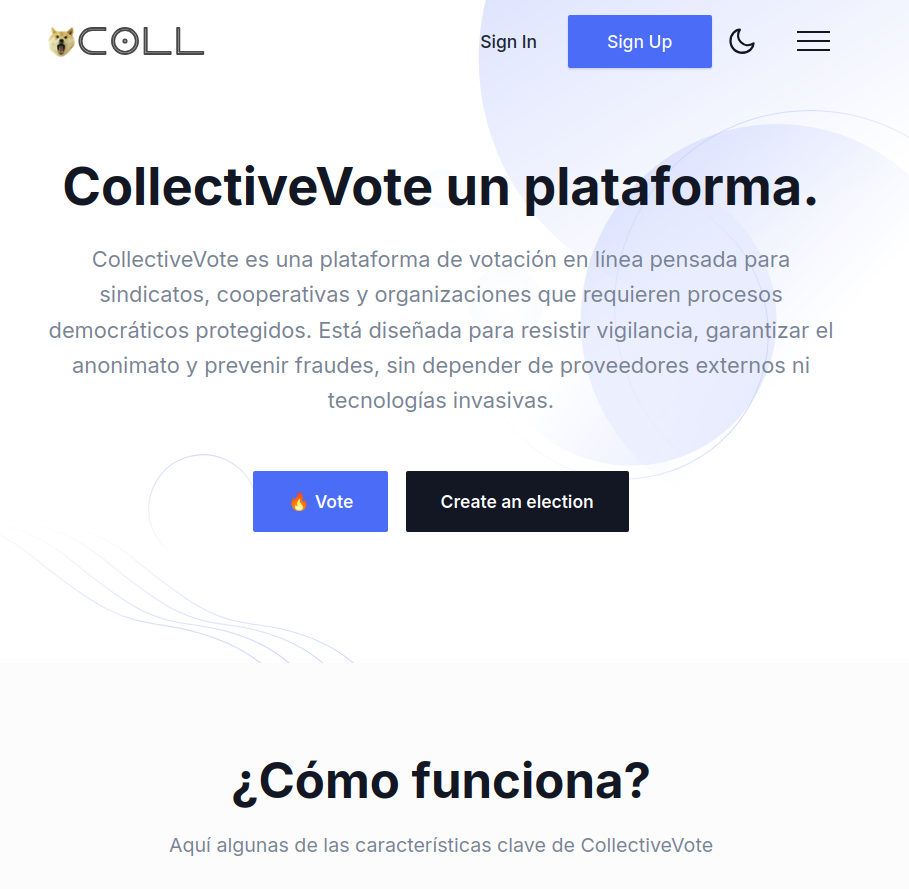
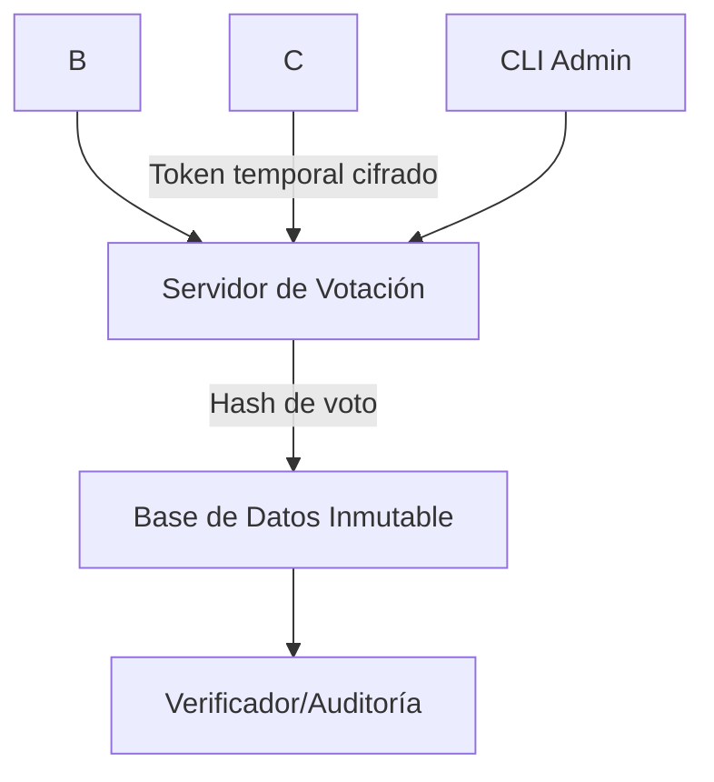

# 🗳️ CollectiveVote – Plataforma de Votación Segura y Anónima para Organizaciones Sindicales

[](https://www.gnu.org/licenses/agpl-3.0)


**CollectiveVote** es una plataforma de votación en línea pensada para sindicatos, cooperativas y organizaciones que requieren procesos democráticos protegidos. Está diseñada para resistir vigilancia, garantizar el anonimato y prevenir fraudes, sin depender de proveedores externos ni tecnologías invasivas.


---

## 🧩 Arquitectura del Sistema



---

## 🔐 Características Principales

* ✅ **Votación anónima y segura**

  * Cada voto se cifra en el navegador con claves públicas.
  * No se guarda metadata del votante con el voto.

* 🗳️ **Soporte para votaciones múltiples**

  * Votaciones de una o varias opciones.
  * Configuración de fechas de inicio y cierre.

* 👥 **Autenticación segura**

  * Basada en tokens únicos por evento, generados por el sindicato.
  * Opcional: integración con listas de emails, documentos, o credenciales físicas.

* 📜 **Auditoría completa**

  * Los resultados pueden verificarse públicamente sin comprometer el anonimato.
  * Hashes de votos y resultados exportables.

* 🔍 **Interfaz clara y accesible**

  * Apta para dispositivos móviles.
  * Modo oscuro y traducción multilenguaje.

* 🧱 **Diseño monolítico pero modular**

  * Backend: Python (FastAPI) con SQLite/PostgreSQL.
  * Frontend: React (ligero, rápido y accesible).
  * Fácil de auto-hostear (Docker support incluido).

* 🐧 **100% Software Libre**

  * Licencia AGPLv3

---

## 🚀 Tecnologías Usadas

| Componente    | Tecnología           |
| ------------- | -------------------- |
| Backend       | Python + FastAPI     |
| Frontend      | React               |
| Base de datos | PostgreSQL / SQLite  |
| Cifrado       | RSA / AES-256        |
| Deploy        | Docker               |
| Auditoría     | Merkle Tree          |

---

## ⚙️ Instalación Básica

```bash
git clone https://github.com/leonkj/unionvote.git
cd unionvote
docker compose up --build
```

Una vez en marcha:

* Frontend disponible en: `http://localhost:3000`
* Admin panel en: `http://localhost:3000/admin`

---

## 🔧 Scripts útiles

```bash
# Crear una elección
./scripts/create_vote.py

# Generar tokens para los votantes
./scripts/generate_tokens.py --count 200

# Auditar votos
./scripts/audit_results.py --election-id 3
```

---

## 🧪 Roadmap (v1.0)

* [x] Cifrado extremo a extremo
* [x] Tokenización segura de acceso
* [x] Auditoría básica de votos
* [x] Web UI simple
* [ ] Soporte para voto delegativo (delegated voting)
* [ ] Integración con Matrix para difusión de resultados
* [ ] Panel de métricas y participación
* [ ] Accesibilidad nivel WCAG 2.1

---

## 🤝 Contribuciones

¿Querés ayudar a que más trabajadores puedan organizarse sin miedo?
Aceptamos issues, pull requests.
