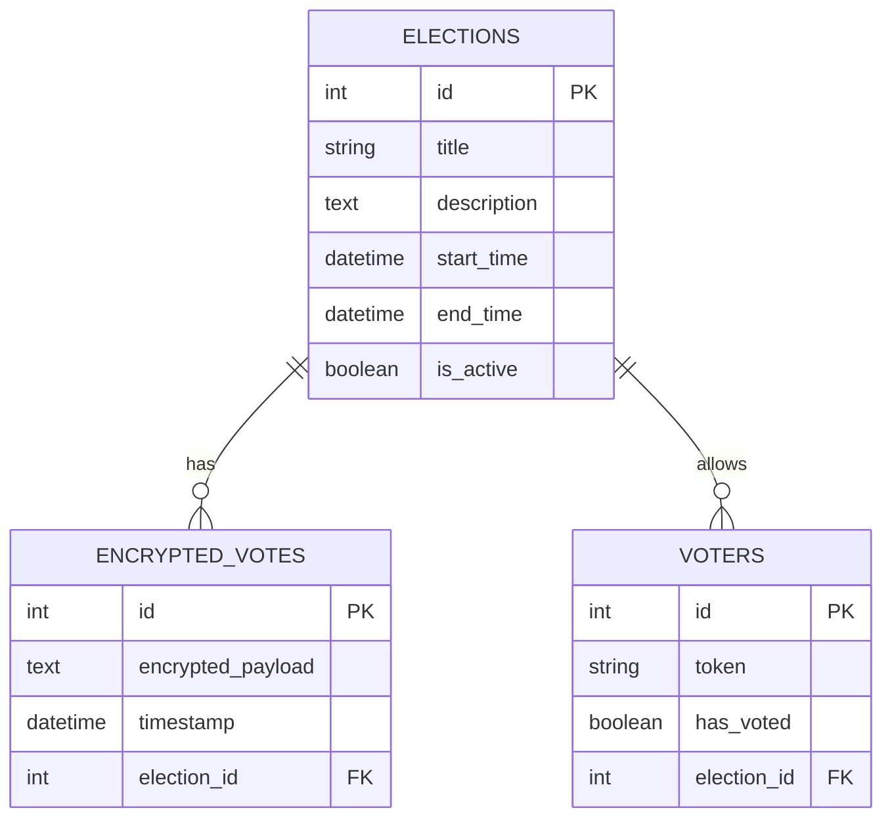

# Database

````

```mermaid
erDiagram
    ELECTIONS ||--o{ ENCRYPTED_VOTES : has
    ELECTIONS ||--o{ VOTERS : allows

    ELECTIONS {
        int id PK
        string title
        text description
        datetime start_time
        datetime end_time
        boolean is_active
    }

    VOTERS {
        int id PK
        string token
        boolean has_voted
        int election_id FK
    }

    ENCRYPTED_VOTES {
        int id PK
        text encrypted_payload
        datetime timestamp
        int election_id FK
    }

```
